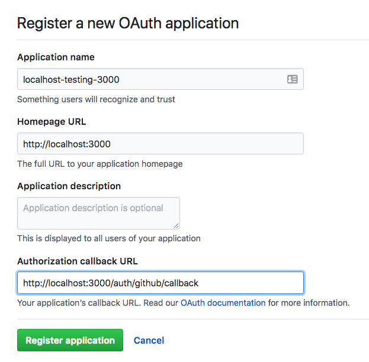
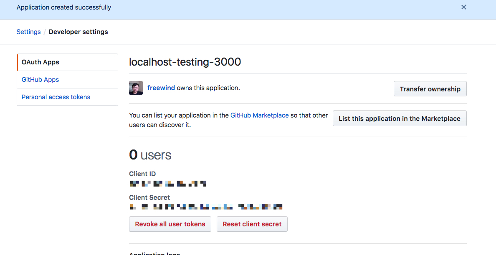

JavaScript PassportJS Express Github Demo
=========================================

获取github oauth2 keys:
---------------------

https://github.com/settings/applications/new





然后修改`passport-config.js`中:

```
const GITHUB_CLIENT_ID = '???';
const GITHUB_CLIENT_SECRET = '???';
```

运行：
---

```
npm install
npm run demo
```

retrieved profile is like:

```
{ id: '333781',
  displayName: '???',
  username: 'freewind',
  profileUrl: 'https://github.com/freewind',
  photos:
   [ { value: 'https://avatars1.githubusercontent.com/u/333781?v=4' } ],
  provider: 'github',
  _raw:
   '{"login":"freewind","id":333781,"node_id":"MDQ6VXNlcjMzMzc4MQ==","avatar_url":"https://avatars1.githubusercontent.com/u/333781?v=4","gravatar_id":"","url":"https://api.github.com/users/freewind","html_url":"https://github.com/freewind","followers_url":"https://api.github.com/users/freewind/followers","following_url":"https://api.github.com/users/freewind/following{/other_user}","gists_url":"https://api.github.com/users/freewind/gists{/gist_id}","starred_url":"https://api.github.com/users/freewind/starred{/owner}{/repo}","subscriptions_url":"https://api.github.com/users/freewind/subscriptions","organizations_url":"https://api.github.com/users/freewind/orgs","repos_url":"https://api.github.com/users/freewind/repos","events_url":"https://api.github.com/users/freewind/events{/privacy}","received_events_url":"https://api.github.com/users/freewind/received_events","type":"User","site_admin":false,"name":null,"company":null,"blog":"","location":null,"email":null,"hireable":null,"bio":null,"public_repos":284,"public_gists":76,"followers":172,"following":64,"created_at":"2010-07-16T07:19:20Z","updated_at":"2018-09-09T14:34:07Z"}',
  _json:
   { login: 'freewind',
     id: 333781,
     node_id: 'MDQ6VXNlcjMzMzc4MQ==',
     avatar_url: 'https://avatars1.githubusercontent.com/u/333781?v=4',
     gravatar_id: '',
     url: 'https://api.github.com/users/freewind',
     html_url: 'https://github.com/freewind',
     followers_url: 'https://api.github.com/users/freewind/followers',
     following_url:
      'https://api.github.com/users/freewind/following{/other_user}',
     gists_url: 'https://api.github.com/users/freewind/gists{/gist_id}',
     starred_url:
      'https://api.github.com/users/freewind/starred{/owner}{/repo}',
     subscriptions_url: 'https://api.github.com/users/freewind/subscriptions',
     organizations_url: 'https://api.github.com/users/freewind/orgs',
     repos_url: 'https://api.github.com/users/freewind/repos',
     events_url: 'https://api.github.com/users/freewind/events{/privacy}',
     received_events_url: 'https://api.github.com/users/freewind/received_events',
     type: 'User',
     site_admin: false,
     name: null,
     company: null,
     blog: '',
     location: null,
     email: null,
     hireable: null,
     bio: null,
     public_repos: 284,
     public_gists: 76,
     followers: 172,
     following: 64,
     created_at: '2010-07-16T07:19:20Z',
     updated_at: '2018-09-09T14:34:07Z' } }

```
